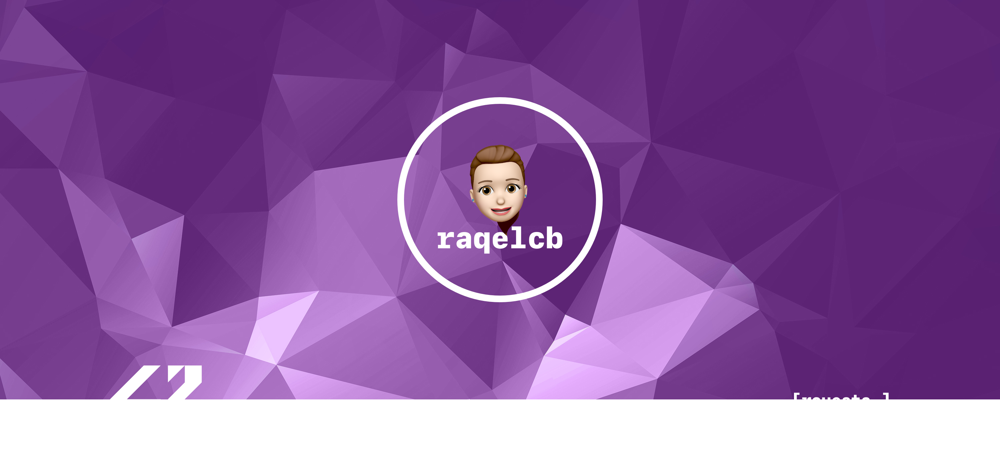

    

 
	<h1>Hello World! I'm Raquel <a href="http://rcbdesigner.com">[raqelcb]</a> 👋 

  

### I'm a Graphic Designer and Frontend Developer ✍️💻

- 🎓 I studied Graphic Design at the [**IED Madrid**](https://iedmadrid.com) and later they gave me a scholarship to study a Master in Marketing. Then I studied an MBA.
- 🏊‍ In February 2020 & July 2021 I was a candidate for the [**42 Madrid School**](https://www.42madrid.com/en/), where during that month I made the piscine.
- 🍏 I'm a [**Apple**](https://apple.com) Certified Support Professional 

- 🌱 I'm currently learning **C** & **C++** at [42Madrid](https://www.42madrid.com/en/)
- 🧠 I'm interesting in **HTML5**, **CSS3**, **SaSS**, **JavaScript**, **TypeScript**, **React**, **Angular**
- ⚙️ I'm currently working at my own projects to create my future.
- 🚀 2022 Goals: learn more & undertake.
---
### Languages and Tools

 
<!--  -->

<!-- -->

	

### 42Madrid

|   Projects	|  Score	| Type |
|---	|---	|--- |
| Libft | | C library |
| Born2BeRoot |  | Systems & Virtualization |
| Get_Next_Line	|  | C function |
| Printf	|  | C library |
| Push_Swap	|  | C & Algorithms |
| Exam Rank 02  |  | Exam Rank 02
| Minitalk	|  | C & Unix |
| So-long	|  | C & Graphics |
| Philosophers	|  | Unix Logic |
| Exam Rank 03	| | Exam Rank 03 |

*NOTE: Top languages does not indicate my skill level or something like that, it's a github metric of which languages i have the most code on github.

	
	
	

